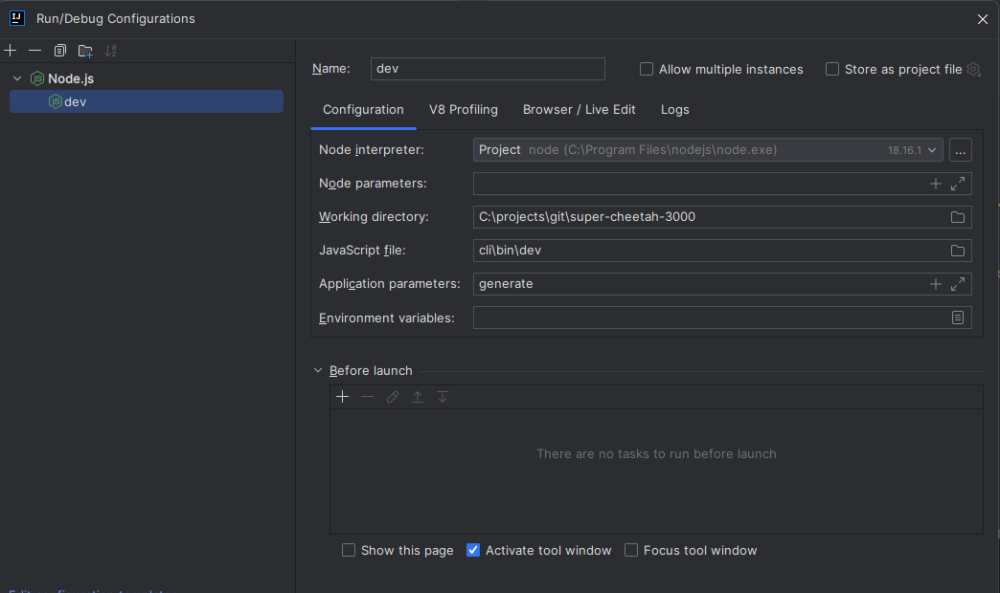

# Recognize Super Cheetah 3000
This repository contains the code for the Recognize Super Cheetah 3000 tool:
a tool that allows you to quickly generate code for a given datamodel.

This readme will be updated as the tool is developed.

## ⚙️ Installation
In order to install Super Cheetah 3000, go to the [releases page](https://github.com/recognizegroup/super-cheetah-3000/releases)
and download the latest release for your operating system. After installation, you can run the tool by running the
`sc3000 version` command in your terminal. If everything went well, you should see the version of the tool printed to
your terminal.

Before you can use the tool, you will have to login. Run the `sc3000 login` command and follow the instructions. After
logging in, you can start using the tool.


## 🚀 Getting Started

In a project where you want to use Super Cheetah 3000, you will have to create a `sc3000.definition.ts` file. This
file will contain your project definition, including entities, generators and security rules.

First, install the `@recognizebv/sc3000-definition` package using Yarn. This package wil help you build your project
definition:

```shell
yarn add --dev @recognizebv/sc3000-definition
```

Then, create a `sc3000.definition.ts` file in the root of your project. An example of such a file can be found below:

```typescript
import { DataType, configureSecurity, createDefinition, createEntity, createProject, useGenerator, azureIdentityProvider, DatabaseType } from '@recognizebv/sc3000-definition'

const project = createEntity('Project')
    .addField('name', DataType.string, { required: true, mainProperty: true })
    .addField('description', DataType.text)
    .addField('externalSyncId', DataType.integer, { editable: false })
    .enableAllOperations()
    .requireRolesForEntity('application-admin')
    .withProperty('icon', 'grid')

const task = createEntity('Task')
    .addField('name', DataType.string, { mainProperty: true })
    .addManyToOne('project', project)
    .enableAllOperations()
    .withProperty('icon', 'import')

// Reference the project entity from the task entity
project
    .addOneToMany('tasks', task)

export default createDefinition()
    .forProject(
        createProject()
            .withClient('recognize')
            .withName('bezoekersapp')
            .withTeam('team-technology')
    )
    .addEntity(project)
    .addEntity(task)
    .withGenerator(
        useGenerator('@recognizegroup/sc3000-kotlin-spring-backend-generator', '^1.0')
            .withInput('directory', 'api')
    )
    .withGenerator(
        useGenerator('@recognizegroup/sc3000-typescript-angular-frontend-generator', '^1.0')
            .withInput('directory', 'frontend')
            .withInput('backendUrl', 'http://localhost:8080')
    )
    .withSecurityConfiguration(
        configureSecurity()
            .addRole('application-admin')
            .addRole('project-manager')
            .withIdentityProvider(
                azureIdentityProvider()
                    .withClientId('0000-0000-0000-0000-0000')
                    .withTenantId('0000-0000-0000-0000-0000')
            )
    )
    .withInfrastructure(
        configureInfrastructure()
            .withNetwork('10.0.0.0/16')
            .withService('api')
            .withService('frontend')
            .withDatabase(DatabaseType.postgres)
            .withStorage('app')
    )

```

Each generator has the option to specify additional requirements in the form of pre-flight checks. These checks will be
executed before the generator is run. If any of the checks fail, the generator will not be run before the issue is
resolved.

## Development
In order to develop the tool, you will need to have Node.js and Yarn installed. After cloning the repository, you can build generator project by running the following command:
```yarn build ``` in the generator project directory.

In case you make changes to the generator project, you need to link the generator project to the cli project. You can do this by running the following command in the generator project directory:
```yarn link ``` in the generator project directory and ```yarn link @recognizegroup/sc3000-generator``` in the cli project directory.

To run or debug the cli project create a nodeJS configuration and select the cli/bin/dev file and add generate as parameter. You should have a `sc3000.definition.ts` file in the root of the cli project. 




## 👋 About The Project

### Built With

* []() Node.js
* []() Typescript
